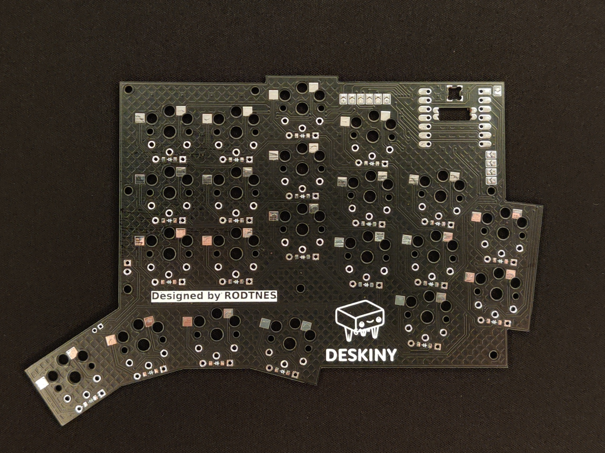
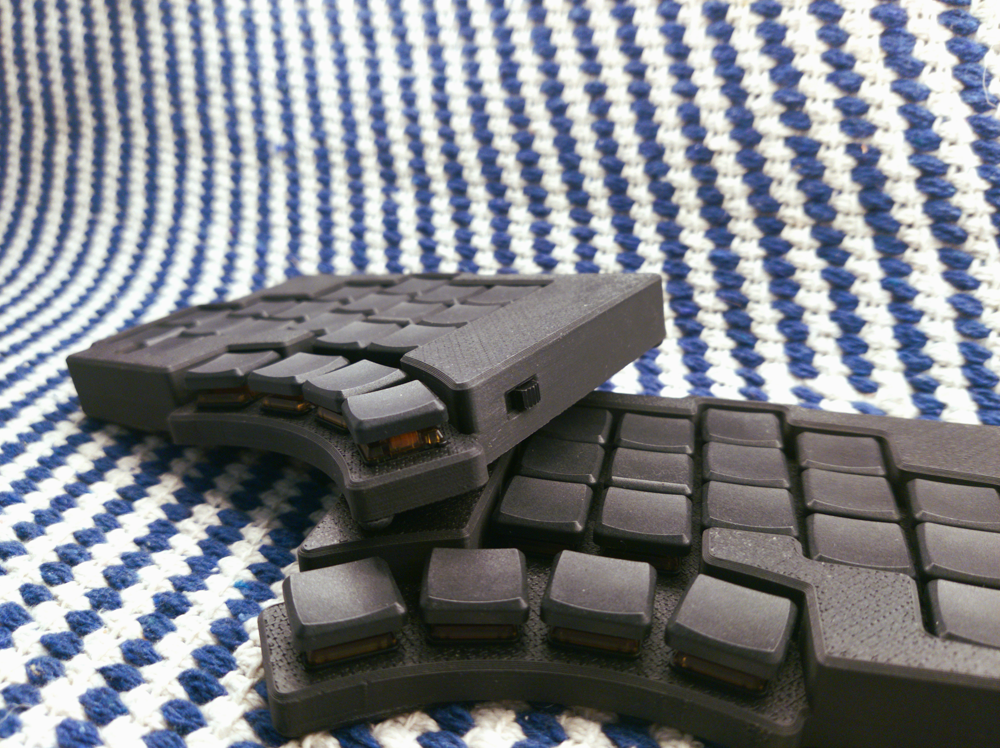

# Deskiny
/ˈdes.kɪ.n-i/
A tiny project one year in the making. A 42 key split wireless keyboard powered by zmk running on two seeeduino xiao boards. Inspired by the TOTEM by GEIGEIGEIST, Deskiny is an attempt to create a layout which functions with a full alpha layer for nordic layouts (æøå) while retaining a compact form factor.

## Gallery

## Case (WIP)
The case  can be found [here](https://a360.co/4eJjC5Y) as a fusion 360 file.
The case is designed to be 3D printed in two parts and then glued together, there is enough space in the case to add foam underneath the board for a bit of sound dampning. *Please note that PCB was designed with holes for M2 screws to be use to secure the PCB to the case, which is not yet implemented.* The case is also designed to be use with just a switch i had lying around so feel free to modify the case to fit your switch of choice.

## Partlist
The following parts are required for the build
- 2x Seeeduino Xiao nrf58
- 2x pcb's
- 2x 3D printed cases
- 42x kailh v1 lowprofile switches
- 42x 1N4148W diodes THT or SMD (SOD 123)
- 2x Li-Pol-battery 3,7V 402050
- Wire for the power switch and battery
- Plastic glue

The following parts are optional
- 42x kailh v1 hotswap sockets
- 6x neodynium magnets 10x10x5mm*
- 2x power switch
*\*The case is big enough to accomodate a variety of different magnet sizes these are just the ones I chose.

## Assembly (WIP)
This is only a rough outline of assembly, if there is interest i wil make a proper build guide.

1. Solder the diodes to the pcb (make sure to solder them in the correct orientation)
2. (optional) Solder hotswap sockets to the pcb
3. Solder microcontroller to the pcb to the top side of the pcb, you can use diode legs to align the microcontroller.
4. Solder the battery connection on the bottom side of the pcb to the microcontroller
5. Solder the jumpers on the bottom side of the pcb
6. Solder connections to the (optional) power switch and battery
7. (optional) glue 3 magnets in each half of the case (positioned in the upper left and right coners and bottom middle)
8. Slide the pcb into the case and push the switches into the pcb and case combo
9. (optional) solder the switches to the pcb
10. (optional) glue in the power switch
11. glue the battery into the case
12. glue in the bottom of the case

## Firmware
The zmk firmware can be found [here](zmk-config-Deskiny) keymaps can esily be created online using the elephant 42 board [here](https://nickcoutsos.github.io/keymap-editor/)
